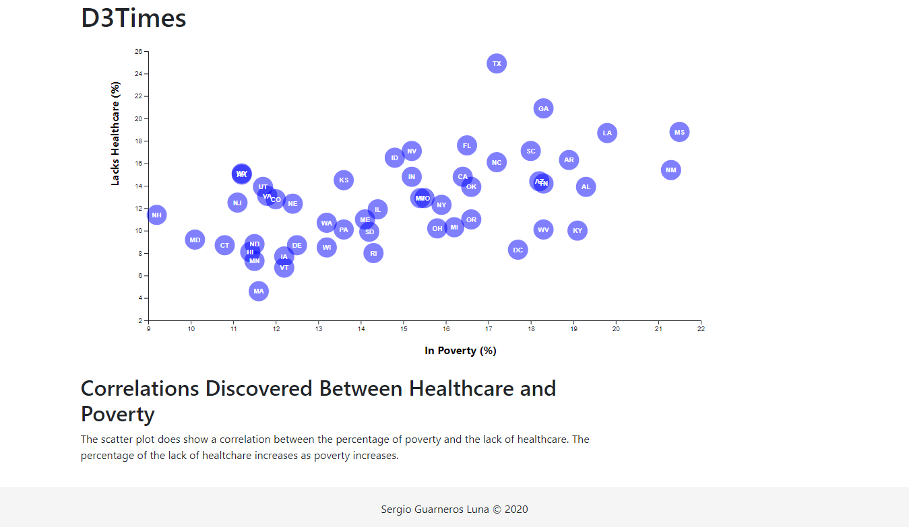
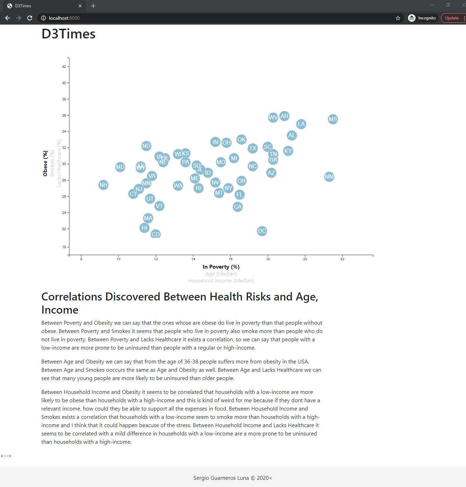

# D3 Homework - Data Journalism and D

# Interactive Visualization
## Contributor
* Sergio Guarneros Luna

---
Table of contents 

1. [Background](#1)
2. [Instructions](#2)
3. [Starter code](#3)
4. [D3 Data Journalism - D3 Doppler](#4)
5. [D3 Data Journalism - Impress the Boss](#5)
6. [Visualization](#6)

---

### Background 
[Go back to the table of contents](#toc)

## Background

Welcome to the newsroom! You've just accepted a data visualization position for a major metro paper. You're tasked with analyzing the current trends shaping people's lives, as well as creating charts, graphs, and interactive elements to help readers understand your findings.

The editor wants to run a series of feature stories about the health risks facing particular demographics. She's counting on you to sniff out the first story idea by sifting through information from the U.S. Census Bureau and the Behavioral Risk Factor Surveillance System.

The data set included with the assignment is based on 2014 ACS 1-year estimates: [https://factfinder.census.gov/faces/nav/jsf/pages/searchresults.xhtml](https://factfinder.census.gov/faces/nav/jsf/pages/searchresults.xhtml), but you are free to investigate a different data set. The current data set includes data on rates of income, obesity, poverty, etc. by state. MOE stands for "margin of error."

---

### Instructions 
[Go back to the table of contents](#toc)

### Core Assignment: D3 Dabbler (Required Assignment)

You need to create a scatter plot between two of the data variables such as `Healthcare vs. Poverty` or `Smokers vs. Age`.

Using the D3 techniques we taught you in class, create a scatter plot that represents each state with circle elements. You'll code this graphic in the `app.js` file of your homework directory—make sure you pull in the data from `data.csv` by using the `d3.csv` function. Your scatter plot should ultimately appear like the image at the top of this section.

* Include state abbreviations in the circles.

* Create and situate your axes and labels to the left and bottom of the chart.

* Note: You'll need to use `python -m http.server` to run the visualization. This will host the page at `localhost:8000` in your web browser.

- - -

### Bonus: Impress the Boss (Optional Assignment)

Why make a static graphic when D3 lets you interact with your data?

#### 1. More Data, More Dynamics

You're going to include more demographics and more risk factors. Place additional labels in your scatter plot and give them click events so that your users can decide which data to display. Animate the transitions for your circles' locations as well as the range of your axes. Do this for two risk factors for each axis. Or, for an extreme challenge, create three for each axis.

* Hint: Try binding all of the CSV data to your circles. This will let you easily determine their x or y values when you click the labels.

#### 2. Incorporate d3-tip

While the ticks on the axes allow us to infer approximate values for each circle, it's impossible to determine the true value without adding another layer of data. Enter tooltips: developers can implement these in their D3 graphics to reveal a specific element's data when the user hovers their cursor over the element. Add tooltips to your circles and display each tooltip with the data that the user has selected. Use the `d3-tip.js` plugin developed by [Justin Palmer](https://github.com/Caged)—we've already included this plugin in your assignment directory.

* Check out [David Gotz's example](https://bl.ocks.org/davegotz/bd54b56723c154d25eedde6504d30ad7) to see how you should implement tooltips with d3-tip.

- - -

### Assessment

Your final product will be assessed on the following metrics:

* Creation of a **new** repository on GitHub called `D3-Challenge` (note the kebab-case). Do not add to an already existing repo.

* Completion of all steps in the core assignment

* Coherency of scatter plot (labels, ticks)

* Visual attraction

* Professionalism

* Ensure your repository has regular commits (i.e. 20+ commits) and a thorough README.md file

---

### [Starter code] 
[Go back to the table of contents](#toc)
#### Files
- index.html -- provided html page for the assignment.
- assets/css/style.css -- style sheet for webpage.
- assets/data/data.csv -- provided data for assignment.
- assets/js/app.js -- javascript file without code.

---

### [D3 Data Journalism - D3 Doppler] 
[Go back to the table of contents](#toc)

#### Files
- index.html -- D3 times webpage scatterplot between two variables.
- assets/js/app.js -- JavaScript for index.html webpage functionality.

---

### [D3 Data Journalism - Impress the Boss] 
[Go back to the table of contents](#toc)

#### Files
- index.html -- D3 times webpage scatterplot between 6 variables.
- assets/js/app.js -- JavaScript for index.html webpage functionality.

---

### Visualization 
[Go back to the table of contents](#toc)

 

 
